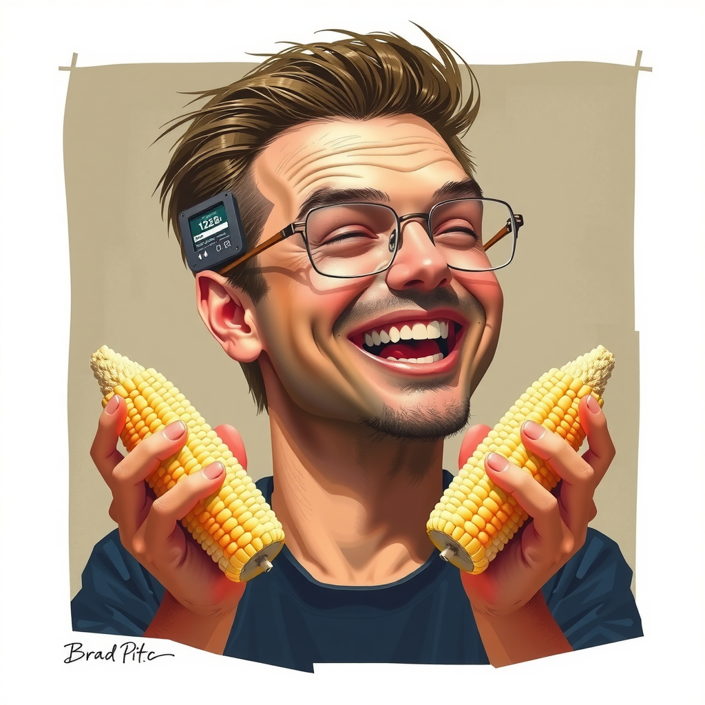
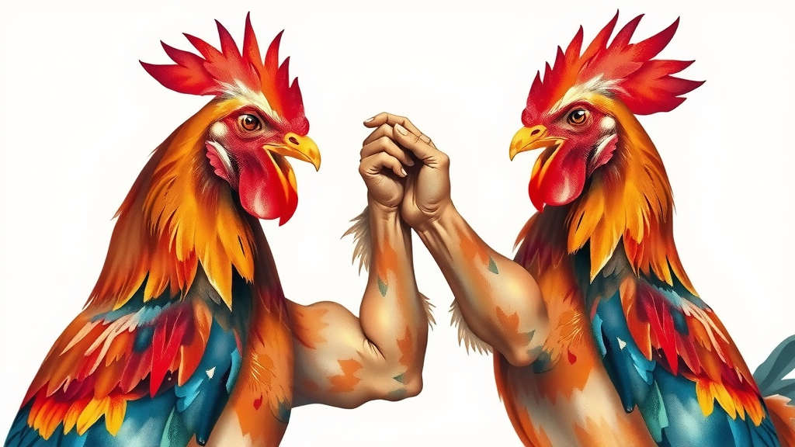
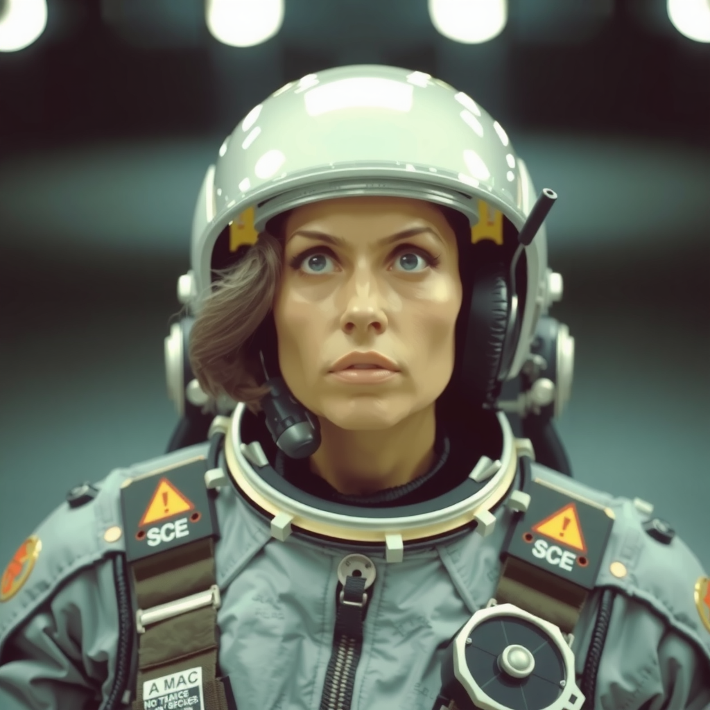
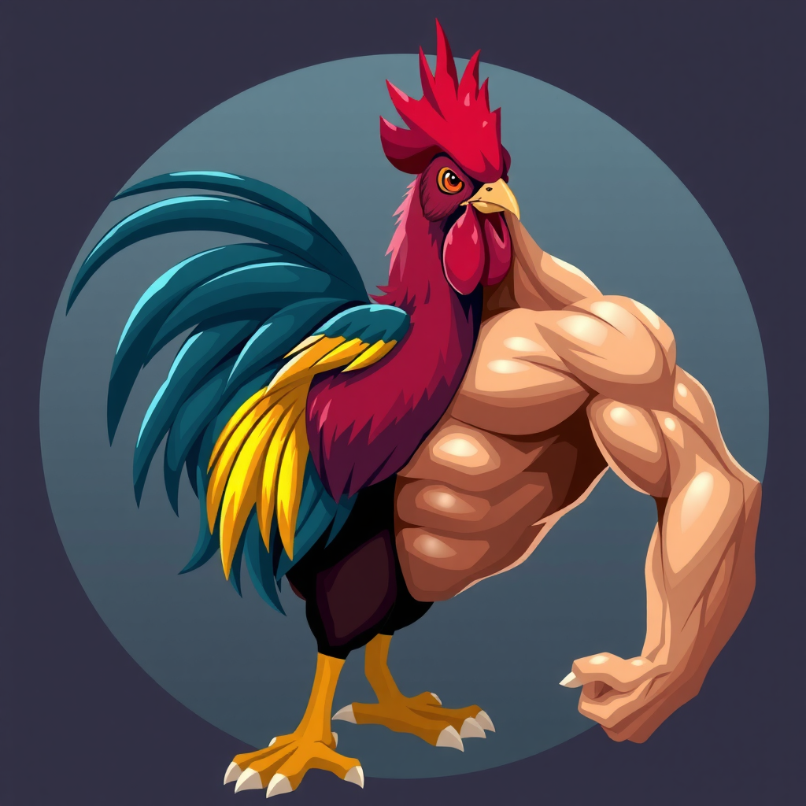
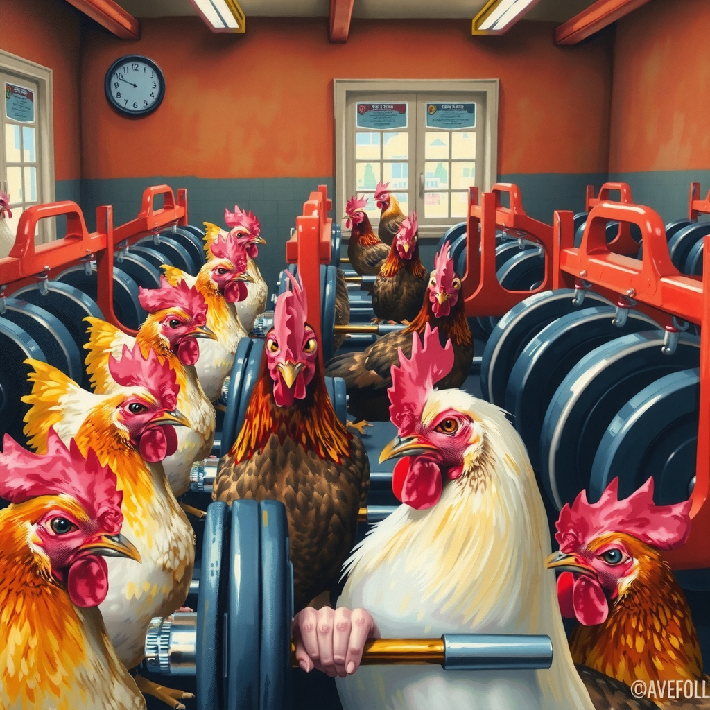

# flux-cli

A CLI to generate images with the flux model on consumer hardware very slowly.

flux-cli is a small command-line tool for generating images using the flux model. It is designed to run on consumer
hardware, but image generation can be very slow without high-end GPUs.

## Project Status

**Archived.** Sadly you can no longer access the FLUX.1-schnell model without logging into hugging face. Additionally,
the project is effectively completed anyhow. It was fun to try to build a minimal offline tool to generate images with "
AI"
on old consumer hardware (i.e. my aging gaming computer).

## Usage

| Option            | shorthand | Description                            |
|-------------------|-----------|----------------------------------------|
| --help            | -h        | print help                             |
| --number          | -n        | the number of images to generate       |
| --output          | -o        | the name of the output image           |
| --prompt          | -p        | the prompt for the model               |
| --prompt2         | -p2       | a second prompt                        |
| --guideance-scale | -gs       | the guideance scale                    |
| --strength        | n/a       | the strength                           |
| --size            | n/a       | the size of the output image in pixels |

## Examples

Despite the lack of power of my machine (or perhaps because of it) I was still able to generate some impressive, often hilarious, outputs. The images
plus the prompt that generated them.

> Brad pitt, shucking corn, laughing, ruthless, caricature

> Watercolor painting, two roosters arm wrestling, with large arms for wings, grinning, Hawk referees

  

> A space pilot, wearing her space flight suit, graying hair, determined to face the future.

> Rooster, colorful, massive, biceps, body building, flexing

> A horde of chickens working out in the gym, getting a pump, colorful, intense, bench press. Oil on canvas

## Retrospective

The main motivation of this project was to be able to generate AI images for free and privately, on my own machine.
There were other options out there, but they all had these really complicated processes to get up and running. Or I had
to run docker or something. I just wanted a minimal tool to send a prompt and get an output. 

Sadly, I learned very quickly that you have to have some decent hardware to get anything close to performant. In my case
I was able to generate a 1:1 ratio image
of, at most, 1024px x 1024px in size. And it took 20-30 minutes per image to generate on my computer. My graphics card
was already several years old (it's even older now, I still have the same one.)

I don't recall putting any special constraints on myself for this project. I just wanted to get up and running (python
is perfect for rapid prototyping). I also wanted to try to write something that wasn't just code soup, so I tried to
break
things up and keep them organized.

All that being said, I had a lot of fun building it. 